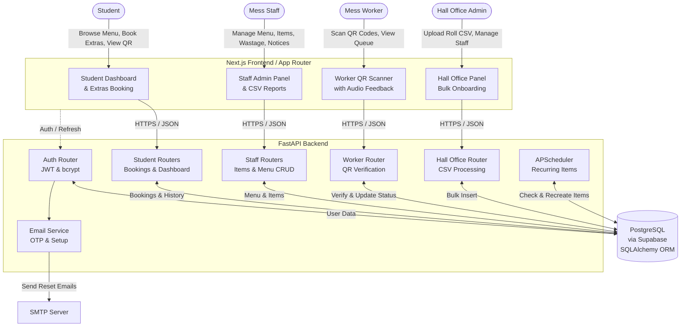

# Hall 12 — Marathas Portal

Hall Management Portal for IIT Kanpur Hall of Residence XII (Marathas). Students browse and book paid food extras, receive a single-use QR code, and a mess worker scans it to mark the item served. Mess staff manage extras, the weekly menu, and daily wastage figures.

## Tech Stack

| Layer | Technology |
|---|---|
| Frontend | Next.js 14+ (App Router), TypeScript, Tailwind CSS |
| Backend | FastAPI, SQLAlchemy ORM, Pydantic v2 |
| Database | PostgreSQL (Supabase-hosted) |
| Auth | Custom JWT (access + refresh tokens), bcrypt |
| QR | `qrcode` (Python) for generation, `html5-qrcode` (JS) for scanning |

## Architecture Diagram



## Quick Start

### Prerequisites

- Python 3.11+
- [uv](https://github.com/astral-sh/uv) (Python package manager)
- Node.js 18+
- A Supabase project with the Postgres connection string

### 1. Backend Setup

```bash
cd backend

# Install dependencies
uv sync

# Create your .env file
cp .env.example .env
# Edit .env — fill in DATABASE_URL, JWT_SECRET, FRONTEND_URL

#for first time only
uv run alembic revision --autogenerate -m "initial"

# Run database migrations
uv run alembic upgrade head

# Seed the initial hall_office admin account
uv run python -m scripts.seed

# Start the backend (port 8000)
uv run uvicorn app.main:app --reload --port 8000
```

### 2. Frontend Setup

```bash
cd frontend

# Install dependencies
npm install

# Create your .env.local file
cp .env.example .env.local
# Edit .env.local if API is not at http://localhost:8000

# Start the frontend (port 3000)
npm run dev
```

### 3. First Login

Use the seeded hall_office admin account:
- **Identifier:** `admin@hall12`
- **Password:** `Hall12Admin!`

> ⚠️ Change this password in production.

From here you can:
1. Upload a student roll number CSV (with Name and Room Number)
2. Create mess_staff and mess_worker accounts
3. Log into those accounts (forced password change on first login)

## Roles

| Role | Access |
|---|---|
| `hall_office` | Upload roll numbers CSV, create/manage staff accounts, post notices |
| `mess_staff` | Manage extras items, view bookings, edit weekly menu, enter wastage, post notices, download CSV reports |
| `mess_worker` | QR scanner (with audio feedback), today's booking queue |
| `student` | View dashboard (wastage, menu, notices), browse/book extras, booking history + QR |

## Project Structure

```
HMP/
├── backend/
│   ├── app/
│   │   ├── main.py          # FastAPI app entry
│   │   ├── config.py        # Environment-based settings
│   │   ├── database.py      # SQLAlchemy engine
│   │   ├── dependencies.py  # Auth, role guards, rate limiting
│   │   ├── models/          # SQLAlchemy ORM models
│   │   ├── schemas/         # Pydantic v2 request/response schemas
│   │   ├── routers/         # API route handlers
│   │   └── services/        # Auth, email, QR, scheduler
│   ├── alembic/             # Database migrations
│   ├── scripts/seed.py      # Bootstrap admin account
│   └── tests/               # pytest test suite
├── frontend/
│   └── src/
│       ├── app/             # Next.js App Router pages
│       ├── components/      # Reusable UI components
│       ├── lib/             # API wrapper, auth context, utilities
│       └── types/           # TypeScript type definitions
├── README.md
└── SECURITY.md
```

## API Endpoints

See `PROJECT.md` for the full API specification. Key route groups:

- `POST /auth/*` — Student Setup flow, Forgot Password OTP, login, refresh, logout
- `GET /dashboard/summary` — Student wastage summary
- `GET /menu/weekly` — Weekly menu
- `GET /items` — Available extras
- `POST /bookings` — Create a booking
- `/staff/*` — Item CRUD, bookings list, menu editor, wastage
- `/worker/*` — QR scan, today's queue
- `/hall-office/*` — CSV upload, staff accounts
- `/notices` — View and post announcements

## Recent Features
- **Notice Board**: Hall Office and Mess Staff can post real-time announcements visible on the student dashboard.
- **Room Number & Identity Tracking**: Automated sync between Hall Office CSV bulk-uploads and student self-registration to prefill Name and Room Numbers.
- **CSV Reports & Billing**: Mess staff can download date-filtered CSV reports of student extra consumption (including Room Numbers and total calculated costs).
- **Advanced Booking Dashboard**: Mess staff have real-time views of active open bookings and finalized preparation targets, filterable by Meal Type and Status.
- **Scanner Audio**: Mess workers get instant audible feedback (success/error chimes) upon scanning a QR code.
- **Access Revocation Sync**: Removing a student from the Allowed Roll Number list instantly deactivates their account without destroying historical purchase data.
- **Full Account Management**: Hall office can create/deactivate/delete staff accounts, and force password resets.
- **Bulk Onboarding & Setup Codes**: Replaced the email-heavy signup flow with a fast bulk onboarding process. The Hall Office can now generate and download one-time setup codes to securely send to hundreds of students via Mail Merge.
- **Forgot Password**: Repurposed the previous OTP-based authentication system into a robust forgot-password flow allowing students to securely reset their accounts via email.

## Notes

- **SMTP & Render Free Tier:** Render free tier blocks outbound ports 25, 465, and 587. To send OTP emails in production on Render, use an SMTP provider like Resend on port 2525. An IPv4 resolution workaround has been implemented natively in `email_service.py` to prevent "Network is unreachable" IPv6 routing errors on Render.
- **Recurring extras:** APScheduler runs inside the FastAPI process, checking hourly for items to recreate on their designated weekday. For production, swap to an external cron or Celery beat.
- **Email in dev:** OTPs are logged to the console. Set `SMTP_*` env vars for real email delivery.
- **Rate limiting:** In-memory (single-process). For multi-process production, use Redis.

eat: comprehensive optimizations, UX improvements, and timezone fixes
- **Optimization:** Overhauled student history fetching by introducing `start_date` and `end_date` parameters to `/bookings/me`, defaulting to today and future items for instant loading.
- **Optimization:** Replaced iterative running total calculations with a lightning-fast aggregate SQL `SUM()` query in the backend.
- **Feature:** Added a `/bookings/me/export` endpoint, enabling students to download their full history as a CSV file.
- **UI/UX:** Added "Load Older Records" and "Download CSV" buttons to the student history view.
- **UI/UX:** Replaced the simple browser popup with a custom "Type CONFIRM" modal for the mess staff's "Mark Missed Meals" action to prevent accidental triggers.
- **UI/UX:** Added dynamic "OPEN" tags, a text search bar, and status filtering dropdowns to the staff extras items page.
- **Bug Fix:** Fixed a massive local timezone parsing bug across the app by creating a global `parseApiDate` utility that correctly assigns UTC contexts to naive timestamps coming from FastAPI.
- **Chore:** Resolved compilation duplicate declaration errors and cleaned up unused imports for a strict production-ready build.