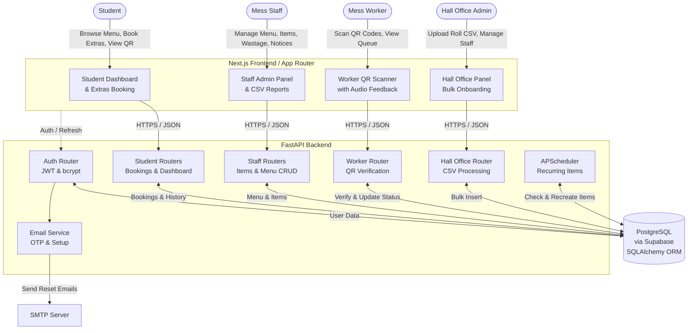

# Hall Management Portal - Complete Authentication Flow

This document outlines the authentication architecture, user interactions, and token management in the HMP repository.

## Overview of Auth Flow

The backend uses a standard JWT-based authentication system with a short-lived access token and a long-lived refresh token stored in an HTTP-only cookie. Passwords are securely hashed using bcrypt.

### 1. User Setup & Registration (Students)
- **Initial State**: The Hall Office uploads a CSV containing allowed roll numbers, emails, and setup codes.
- **Verification**: A student enters their roll number and setup code (`/auth/setup/verify`).
- **Completion**: The student provides their name, room number, and a new password (`/auth/setup/complete`). The backend creates their `User` record, setting their `identifier` to their email (or `roll_no@student.iitk.ac.in`).

### 2. Login Flow
- **Request**: The user (student, staff, worker, or admin) submits their `identifier` and `password` to `/auth/login`.
- **Validation**: The backend checks the `identifier`, verifies the password hash, and ensures the account is active.
- **Token Generation**: 
  - An `access_token` (JWT) is returned in the JSON response body.
  - A `refresh_token` (JWT) is set as an `HttpOnly`, `SameSite=Lax` cookie. This prevents XSS attacks from stealing the refresh token.
- **Forced Password Change**: Staff accounts created by the Hall Office may have `must_change_password=True`. If so, login returns a temporary token, requiring them to hit `/auth/change-password` before getting real tokens.

### 3. Authenticated Requests
- The frontend includes the `access_token` in the `Authorization: Bearer <token>` header for all protected API calls.
- The backend's `get_current_user` dependency intercepts this, decodes the JWT, and loads the user from the database.
- The `/auth/me` endpoint uses this exact mechanism to safely return the full user profile (`UserBrief`).

### 4. Token Refresh Flow
- When the `access_token` expires, the frontend makes a request to `/auth/refresh`.
- The browser automatically includes the `HttpOnly` `refresh_token` cookie.
- The backend validates the refresh token and returns a new `access_token` in the JSON response, allowing the user to stay logged in without re-entering their password.

### 5. Logout
- The user requests `/auth/logout`.
- The backend clears the `refresh_token` cookie by setting it to expire immediately.
- The frontend discards the `access_token` from memory.

## Architecture Diagram

